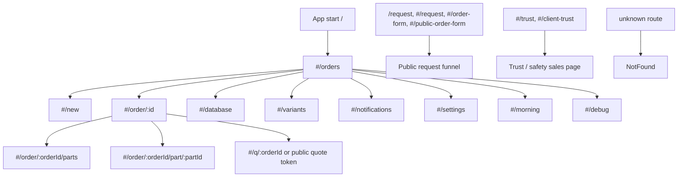

# UX/UI QA audit, карта приложения и план исправлений

Дата проверки: 6 июня 2026  
Среда: Playwright + Chromium, `http://localhost:5174`  
Viewports: desktop `1280x720`, mobile `390x844`  
Артефакты: `test-results/ux-ui-audit-2026-06-06`

## Краткий вывод

Основные экраны приложения визуально доступны на desktop и mobile, без глобального горизонтального скролла и без битых видимых изображений на главных маршрутах. Критический риск найден в deep link сценарии: прямой вход на карточку заказа `/#/order/:id` приводит к белому экрану и очищенному `#root`. Также есть backend/schema проблемы, которые напрямую ухудшают UX: повторные `400` по заказам, `401` на supplier view, ошибки публичной диагностики и потенциально недоступные изображения деталей.

## Покрытие проверки

Проверены маршруты:

| Раздел | Route | Desktop | Mobile | Примечание |
|---|---|---:|---:|---|
| Список заказов | `/#/orders` | Да | Да | Карточка заказа, поиск, фильтры, табы статусов |
| Новый заказ | `/#/new` | Да | Да | Форма авто/клиента, базовая валидация обязательных полей |
| Поставщики | `/#/database` | Да | Да | Список, фильтры, карточки, supplier fallback |
| Варианты | `/#/variants` | Да | Да | Сортировка, карточки вариантов, фото |
| Уведомления | `/#/notifications` | Да | Да | Фильтры, action log, архив |
| Настройки | `/#/settings` | Да | Да | Public Quote, компания, система, опасные действия |
| Morning | `/#/morning` | Да | Да | Daily dashboard |
| Debug | `/#/debug` | Да | Да | Логи и egress debug |
| Trust page | `/#/trust` | Да | Да | Публичный trust/sales экран |
| Public request | `/request`, `/#/request` | Да | Да | Многошаговая публичная форма |
| Not found | `/#/does-not-exist` | Да | Да | При последовательной проверке был route-state артефакт, в чистом контексте нужен отдельный regression guard |
| Order detail | `/#/order/:id` | Нет | Нет | Критический white screen |
| Order parts | `/#/order/:id/parts` | Нет | Нет | После падения detail screen корень приложения пустой |
| Part detail | `/#/order/:id/part/:partId` | Нет | Нет | После падения detail screen корень приложения пустой |
| Public quote | `/#/q/:orderId` | Нет | Нет | Требуется отдельная проверка валидного public token/snapshot |

## Карта приложения

## Основные пользовательские сценарии

| Сценарий | Проверенные шаги | UX статус |
|---|---|---|
| Оператор открывает список заказов | Загрузка, табы, поиск, фильтр, карточка заказа | Работает, но есть backend errors и мелкие touch targets |
| Оператор создает заказ | Переход `New`, обязательные поля brand/model/year, кнопка создания | Базовая форма видна, требуется расширить e2e на успешное создание |
| Оператор ищет поставщика | Список suppliers, быстрые теги, карточки, trust indicators | Работает через fallback, но основной enriched view дает `401` |
| Оператор смотрит варианты | Сортировки, карточка варианта, фото, цена | Работает, есть внутренние overflow-зоны |
| Оператор смотрит уведомления | Фильтры, read/archive/actions/system tabs | Работает, но слишком много маленьких целей на mobile |
| Менеджер меняет настройки | Public Quote, company/system sections, save action | Работает визуально, страница плотная и требует лучшего статуса сохранения |
| Клиент заполняет публичную заявку | `/request`, шаги авто/детали/контакты/подтверждение | Работает визуально, но boot diagnostics дают ошибки |
| Оператор открывает прямую ссылку на заказ | Fresh context `/#/order/:id` | Не работает, белый экран |

## Severity report

### Critical

1. Прямой вход на `/#/order/:id` ломает все приложение белым экраном.
   - Воспроизведение: `http://localhost:5174/#/order/bd338569-b7a0-405c-9952-ae69fad2dbab`.
   - Факт: `bodyTextLength: 0`, `rootChildren: 0`, `rootHtmlLength: 0`.
   - Консоль: `React has detected a change in the order of Hooks called by OrderDetailsScreen`, затем `Error: Rendered more hooks than during the previous render`.
   - Кодовая зона риска: `screens/OrderDetailsScreen.tsx`, ранние `return` для `orderMissing` находятся до последующих hooks, например блоки около строк 825, 836, 968 и `useMemo` около 1024.
   - Артефакты: `test-results/ux-ui-audit-2026-06-06/repro-order-detail-white-screen.json`, `test-results/ux-ui-audit-2026-06-06/repro-order-detail-white-screen.png`.
   - UX impact: оператор теряет экран полностью, навигация и восстановление из UI невозможны.

### High

1. Несовпадение схемы Supabase ломает загрузку заказов и деталей.
   - Ошибки: `orders.discount_type`, `orders.discount_percent`, `orders.discount_fixed_aed` отсутствуют.
   - Видно на `/orders` и `/#/order/:id`, desktop и mobile.
   - UX impact: данные могут быть неполными, deep links нестабильны, консоль загрязняется повторными `400`.

2. `v_shops_enriched` недоступен для текущего клиента.
   - Ошибка: `401`, `permission denied for view v_shops_enriched`.
   - Приложение использует fallback на shops table, но это деградированный режим.
   - UX impact: supplier list может показывать неполные enriched поля, trust/radar метрики могут быть неточными.

3. Изображения деталей в storage возвращают `400` на deep-link сценарии.
   - Примеры из логов: `parts/fq1gpv78i/example/0.jpg`, `example/1.jpg`, `example/2.jpg`, `example/3.jpg`.
   - UX impact: пользователь может видеть пустые фото или placeholders вместо доказательств детали.

### Medium

1. Публичная форма `/request` при прямом входе пишет recoverable boot errors.
   - События: `[public-route:boot] Public route storage reset completed with recoverable errors`, `net::ERR_ABORTED`, ошибка проверки миграции.
   - UX impact: форма видна, но технические ошибки увеличивают риск нестабильного старта.

2. На нескольких экранах много touch targets меньше 36 px.
   - `notifications`: 18, `suppliers`: 11, `orders`: 8, `variants`: 6, `debug`: 6, public request: 6.
   - UX impact: на mobile сложнее попадать в кнопки и чипы фильтров.

3. Есть внутренние overflow-зоны без глобального horizontal scroll.
   - `orders`: строка табов статусов.
   - `suppliers`, `variants`, `trust`, `notifications`: отдельные контейнеры шире client area.
   - UX impact: элементы выглядят тесно, часть контента может казаться обрезанной.

4. `/#/settings` слишком плотный для mobile.
   - Видны только заголовки секций и общий `Сохранить изменения`.
   - UX impact: сложно понять, что изменилось, что сохранено, где ошибка в настройке.

5. `/#/debug` доступен как обычный маршрут.
   - UX impact: если это production сборка, пользователи могут видеть внутренние REST/storage counters и technical logs.

### Low

1. Смешение языков в UI снижает ощущение цельности.
   - Примеры: `Archive`, `Fast WhatsApp`, `Visit today`, `CONTACT OK`, `Qty`, `Loading...`.

2. Некоторые строки выглядят техническими или внутренними.
   - Примеры: `Cloud: ON | Form`, `EGRESS DEBUG (LOCAL ONLY)`.

3. `/#/does-not-exist` в последовательном сценарии после public route показал публичную форму вместо NotFound.
   - В чистом контексте это нужно закрепить отдельным regression test, так как поведение похоже на route-state/cache artifact.

## UX/UI план исправлений

### Phase 0: блокеры перед релизом

1. Починить hook-order crash в `OrderDetailsScreen`.
   - Все hooks должны вызываться до любых условных `return`, либо heavy detail UI нужно вынести в дочерний компонент, который рендерится только когда `order` найден.
   - Добавить error boundary вокруг route content, чтобы future runtime error показывал fallback экран, а не пустой `#root`.

2. Синхронизировать frontend schema и Supabase.
   - Добавить/проверить migration для `discount_type`, `discount_percent`, `discount_fixed_aed`.
   - Проверить select projections в `serverApi.ts`, `orderStore.ts`, `publicQuoteApi.ts`.

3. Исправить доступ к `v_shops_enriched`.
   - Проверить RLS/policies/grants для publishable client.
   - Если view нельзя открывать публично, сделать серверный endpoint или явно убрать enriched dependency из client path.

4. Проверить storage paths для фото деталей.
   - Для отсутствующих фото показывать понятный placeholder и не логировать repeated 400 как критический шум.

### Phase 1: устойчивость маршрутов

1. Добавить regression tests для прямых ссылок:
   - `/#/orders`
   - `/#/order/:id`
   - `/#/order/:id/parts`
   - `/#/order/:id/part/:partId`
   - `/#/q/:token`
   - `/request`
   - unknown route

2. Для dynamic routes договориться о трех UX состояниях:
   - loading skeleton
   - not found with retry/back action
   - loaded screen with stable header and actions

3. Консольный gate в Playwright:
   - pageerror = test failure
   - `Rendered more hooks`, `Hydration`, `Uncaught Error` = test failure
   - `400/401` по known endpoints = отдельный high-priority fail или quarantine list с owner.

### Phase 2: mobile ergonomics

1. Привести интерактивы к минимуму 40-44 px по высоте/ширине.
2. Горизонтальные filter chips оформить как явный scrollable rail с fade/spacing.
3. У карточек orders/suppliers/variants закрепить стабильные зоны: title, metadata, status, primary action.
4. Проверить bottom navigation safe-area и отсутствие перекрытия последнего элемента списка.

### Phase 3: визуальная и текстовая консистентность

1. Выровнять язык интерфейса: русский как основной, английский только для брендов и технических debug экранов.
2. Унифицировать статусы и чипы: одинаковые цвета, casing, spacing, порядок.
3. Настройки разделить на понятные группы с локальным статусом сохранения.
4. Public form очистить от технических boot/status labels для клиента.

### Phase 4: постоянная QA сетка

1. Запускать smoke e2e на desktop и mobile перед каждым релизом.
2. Хранить Playwright screenshots только для failed/changed visual states.
3. Добавить отдельный UX audit spec, который собирает:
   - body text not empty
   - no global horizontal overflow
   - no unnamed buttons/inputs
   - no broken visible images
   - tap target summary
   - console/pageerror summary

## QA checklist для следующего прохода

| Проверка | Ожидаемое состояние |
|---|---|
| Все основные routes открываются в fresh context | Нет белых экранов, `#root` не пустой |
| Console gate | Нет `pageerror`, hook errors, uncaught runtime errors |
| Orders API | Нет `400` из-за missing columns |
| Suppliers API | Нет `401` на enriched view или fallback явно принят |
| Public request | Нет boot/migration errors в клиентской консоли |
| Images | Все видимые фото либо загрузились, либо имеют UI placeholder |
| Mobile tap targets | Основные actions не меньше 40 px |
| Search/filter chips | Не ломают layout, скролл очевиден |
| Settings save | Есть feedback success/error и disabled/loading state |
| Unknown route | Показывает NotFound в чистом и последовательном сценариях |

## Артефакты проверки

| Файл | Содержание |
|---|---|
| `test-results/ux-ui-audit-2026-06-06/summary.json` | Batch audit основных статических маршрутов desktop/mobile |
| `test-results/ux-ui-audit-2026-06-06/dynamic-routes.json` | Проверка dynamic routes по существующему order id |
| `test-results/ux-ui-audit-2026-06-06/repro-order-detail-white-screen.json` | Отдельное воспроизведение critical white screen |
| `test-results/ux-ui-audit-2026-06-06/*.png` | Desktop/mobile скриншоты всех проверенных экранов |

## Минимальный regression набор

Текущий набор Playwright тестов находится в `tests/app.e2e.spec.ts`. Для следующего шага рекомендуется добавить отдельный файл `tests/ux-routes.e2e.spec.ts` с console gate и проверкой fresh-context deep links, но после исправления `OrderDetailsScreen`, иначе тест будет стабильно падать на уже найденном critical дефекте.
